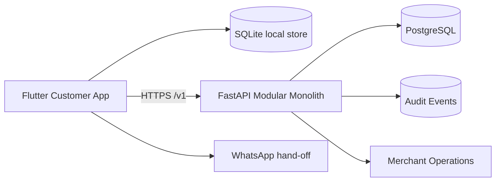

# Jahhezly


**Offline-first retail Click & Collect · Daily Catalog · Order Preparation · Pickup**

> **Portfolio release candidate:** `0.2.0`

Jahhezly is a personal full-stack portfolio project by **Mohammed Yaman ALdous**. It models a practical retail workflow where customers can browse a lightweight store catalog, build a shopping list/order, submit it when connected, and collect a store-prepared order with less waiting at peak time.

> **Portfolio scope:** general retail. The project is designed for a Syrian market scenario with Arabic + English support and SYP pricing.

## Why I built it

I designed Jahhezly around a simple idea: let people prepare their shopping before arriving at a store, while giving the store a structured preparation workflow. The engineering challenge is not the cart alone; it is keeping prices, availability, order state, authorization, offline drafts, retries, and merchant concurrency correct.

## Product flow

```text
Store selection
    ↓
Cached / current catalog
    ↓
Cart / shopping list
    ↓
Server validation at submission
    ↓
SUBMITTED
    ↓
ACCEPTED
    ↓
PREPARING
    ↓
READY_FOR_PICKUP
    ↓
COLLECTED
```

Offline catalog browsing and cart construction remain useful from locally synchronized data. A local draft is never represented as a confirmed order, and final price/availability decisions remain server-authoritative.

## Engineering highlights

- **Offline-first client foundation:** SQLite cache, durable cart state, and a persistent sync queue.
- **Server-authoritative commercial truth:** current price and availability are revalidated during submission.
- **Idempotent order creation:** repeated submissions reuse the same key instead of creating duplicate business orders.
- **Optimistic concurrency:** merchant order transitions require the expected version to avoid stale UI overwrites.
- **Tenant/store authorization:** merchant permissions are resolved from server-side memberships rather than client-supplied role flags.
- **Historical snapshots:** accepted order items preserve the name, unit price, currency, and line total relevant at acceptance.
- **Auditability:** high-value catalog and order mutations produce audit records.
- **WhatsApp boundary:** Jahhezly may open a user-controlled WhatsApp hand-off, but opening WhatsApp is never treated as delivery evidence.
- **Notification boundary:** order-state changes have an in-app status surface; push delivery is isolated behind a future provider adapter.
- **Bilingual direction:** Arabic RTL and English LTR are treated as first-class presentation modes.
- **Release honesty:** tested, verified, built, and released are recorded separately.

## Architecture



```text
Mobile presentation
        ↓
Application/use-cases
        ↓
Repositories
        ↓
SQLite cache + sync queue / HTTP API

REST routes
        ↓
Application services
        ↓
Domain rules
        ↓
SQLAlchemy persistence
```

The V1 architecture deliberately avoids microservices, Kafka, Redis clusters, and other distributed infrastructure that is not justified by the current scope.

## Technology stack

| Area | Technology |
|---|---|
| Mobile | Flutter / Dart |
| Local data | SQLite via `sqflite` |
| Backend API | FastAPI / Python |
| Persistence | SQLAlchemy |
| Primary datastore target | PostgreSQL |
| API | REST `/v1` |
| Auth | JWT bearer + server-side membership lookup |
| Migrations | Alembic |
| Backend tests | pytest + FastAPI TestClient |
| Communication | User-controlled WhatsApp hand-off |

## Real merchants in the portfolio scenario

The owner authorized the use of these business names in the portfolio:

| Merchant | Context | Branches |
|---|---|---:|
| **Paris Market** | Grocery + household retail; Basra, Daraa | 1 |
| **cham-center** | General variety / mini-mall concept; Kafr Sousa, Damascus | 4 |

These names are included as owner-authorized portfolio scenario data. The repository does **not** claim that either business is a production customer, commercial partner, endorser, or source of the illustrative catalog prices.

## Validation history

The repository records a historical usage snapshot supplied directly by the owner. Because no screenshots, logs, or reports were available, those figures are kept separate from engineering verification and are not used as independent production metrics. See [`docs/VALIDATION.md`](docs/VALIDATION.md).

## Honest implementation status

**Implemented in source**

Backend domain/API/authz/catalog/order/audit/migration baseline, Flutter customer and merchant source, SQLite local persistence, store-scoped offline cache/cart, order queue boundaries, WhatsApp adapter, merchant API, bilingual catalog fields, documentation, demo seed data, and automated backend tests.

**Tested in the current environment**

Backend pytest suite, Python compilation, repository/secret validation, mobile source-structure validation, demo seeding, and Alembic migration checks through `0004`.

**Not verified in the current environment**

Flutter compilation/device behavior, iOS/Android release artifacts, live PostgreSQL runtime, production push notifications, external WhatsApp delivery, production hosting, and production load measurements.

No production deployment, revenue, uptime, customer contracts, or app-store publication is claimed.

## Repository structure

```text
JAHHEZLY/
├── apps/mobile/            # Flutter customer app source
├── backend/                # FastAPI modular monolith
├── assets/brand/           # Owner-provided brand assets
├── data/demo/              # Clearly-labelled portfolio data
├── docs/                   # Architecture, security, API, privacy, evidence
├── scripts/                # Repository validation / artifact hashing
├── .github/workflows/      # CI configuration
├── PROJECT_STATE.md
├── OPEN_QUESTIONS.md
├── ASSUMPTIONS.md
├── DELIVERY_MANIFEST.md
├── RISK_REGISTER.md
├── SECURITY_RISK_REGISTER.md
├── SECURITY.md
├── CONTRIBUTING.md
├── LICENSE
└── .env.example
```

## Run the backend

```bash
cd backend
python -m venv .venv
source .venv/bin/activate  # Windows: .venv\Scripts\activate
pip install -e ".[dev]"
pytest -q
uvicorn app.main:app --reload
```

The default automated test database uses SQLite. For a PostgreSQL-backed run, set `JAHHEZLY_DB_URL` to your local or hosted connection string.

### Seed the demo scenario

```bash
cd backend
JAHHEZLY_DEMO_STAFF_PASSWORD=change-me-for-local-demo \
python -m app.seed_demo
```

The seed command refuses to use a password from source control; provide it through the environment when running locally.

## Mobile source

```bash
cd apps/mobile
flutter pub get
flutter analyze
flutter test
flutter run
```

Flutter/Dart were not available in the build environment used to prepare this repository, so the mobile source is not represented as device-verified.

## Documentation map

- [`docs/ARCHITECTURE.md`](docs/ARCHITECTURE.md) — system boundaries and decisions
- [`docs/API_CONTRACT.md`](docs/API_CONTRACT.md) — endpoint and error contract
- [`docs/DATA_MODEL.md`](docs/DATA_MODEL.md) — persistence model
- [`docs/SECURITY.md`](docs/SECURITY.md) — threat controls
- [`docs/PRIVACY_SPEC.md`](docs/PRIVACY_SPEC.md) — data minimization
- [`docs/DATA_MIGRATION_PLAN.md`](docs/DATA_MIGRATION_PLAN.md) — schema evolution
- [`docs/INTEGRATION_SPEC.md`](docs/INTEGRATION_SPEC.md) — WhatsApp + future provider boundaries
- [`docs/BRAND_GUIDELINES.md`](docs/BRAND_GUIDELINES.md) — visual system
- [`docs/VALIDATION.md`](docs/VALIDATION.md) — owner-reported usage history
- [`docs/openapi.json`](docs/openapi.json) — generated `v1` API schema
- [`docs/EVIDENCE.md`](docs/EVIDENCE.md) — actual verification evidence
- [`docs/AUTHOR.md`](docs/AUTHOR.md) — ownership and author metadata

## License & ownership

The original Jahhezly source and project assets are proprietary to **Mohammed Yaman ALdous**. See [`LICENSE`](LICENSE). Third-party dependencies retain their own licenses.
